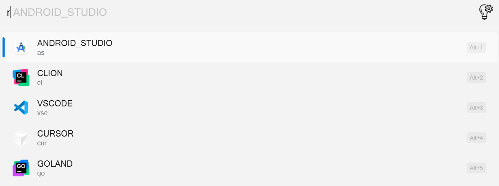
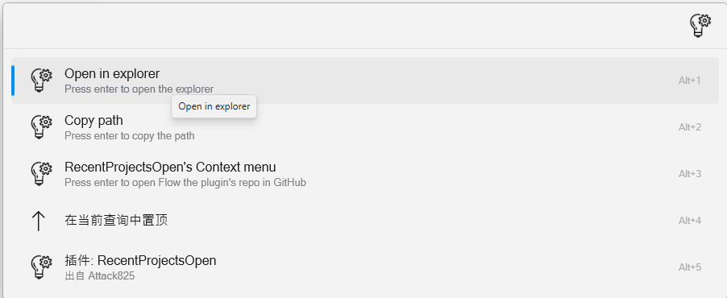

# Flow.Launcher.Plugin.RecentProjectsOpen

A plugin that enables quick access to recent projects across various IDEs like VSCode and Intellij idea efficiency.

## Installation

Download from the store

## Supported applications

- [x] visual studio code
- [x] pycharm
- [x] clion
- [x] goland
- [x] intellij idea
- [x] android studio
- [x] cursor
- [x] sumatra pdf
- [x] trae
- [x] vscode ssh
- [x] typora

You can access different IDEs using the following format:

```python
{
    "vsc": "VSCODE",
    "py": "PYCHARM",
    "cl": "CLION",
    "go": "GOLAND",
    "idea": "INTELLIJ_IDEA",
    "as": "ANDROID_STUDIO",
    "cur":"CURSOR",
    "pdf":"SUMATRA_PDF",
    "trae":"TRAE",
    "vscs":"VSCODE_SSH",
    "ty": "TYPORA",
}
```

## Configuration

All configurations can be done in the Settings Panel. Change the configurations as needed and they will be applied immediately.

### Program Path

- Configure application paths in the following format:

  ```plaintext
  APP_DOWNLOAD=C:/path/to/app.exe
  APP_STORAGE=C:/path/to/storage/file
  ```

- Each application needs both DOWNLOAD and STORAGE entries
- Example configuration:

  ```plaintext
  VSCODE_DOWNLOAD=D:/VSCode/bin/code
  VSCODE_STORAGE=C:/Users/YourUsername/AppData/Roaming/Code/User/globalStorage/storage.json
  ANDROID_STUDIO_DOWNLOAD=D:/Android Studio/bin/studio64.exe
  ANDROID_STUDIO_STORAGE=C:/Users/YourUsername/AppData/Roaming/Google/AndroidStudio2024.1/options/recentProjects.xml
  INTELLIJ_IDEA_DOWNLOAD=D:/IntelliJ IDEA 2024.3/bin/idea64.exe
  INTELLIJ_IDEA_STORAGE=C:/Users/YourUsername/AppData/Roaming/JetBrains/IntelliJIdea2024.3/options/recentProjects.xml
  GOLAND_DOWNLOAD=D:/goland/GoLand 2023.2/bin/goland64.exe
  GOLAND_STORAGE=C:/Users/YourUsername/AppData/Roaming/JetBrains/GoLand2023.2/options/recentProjects.xml
  CLION_DOWNLOAD=D:/Clion/CLion 2024.1.4/bin/clion64.exe
  CLION_STORAGE=C:/Users/YourUsername/AppData/Roaming/JetBrains/CLion2024.1/options/recentProjects.xml
  CURSOR_DOWNLOAD=C:/Users/YourUsername/AppData/Local/Programs/cursor/Cursor.exe
  CURSOR_STORAGE=C:/Users/YourUsername/AppData/Roaming/Cursor/globalStorage/storage.json
  TYPORA_DOWNLOAD=D:/Typora/Typora.exe
  TYPORA_STORAGE=C:/Users/YourUsername/AppData/Roaming/Typora/history.data
  ```

### Tips

- **Verify Paths**: Ensure that the paths you enter are correct and that the files or executables exist at those locations
- **Permissions**: Make sure that Flow Launcher has the necessary permissions to access the specified directories and files
- **Path Format**: Use forward slashes (`/`) or double backslashes (`\\`) in Windows paths

## Usage

To open a project named "MyProject" in Visual Studio Code, you would use:

r



r vsc


r vsc My


r vsc 空


context menu



## Feature

- [x] fuzzy search
- [x] support pinyin
- [x] prevent configurations from disappearing after updates
- [x] open in file explorer and copy absolute path

## Contribute

### Development Setup

1. Fork and clone the repository
2. Install development dependencies:

   ```bash
   # Create and activate virtual environment (recommended)
   python -m venv venv
   source venv/bin/activate  # Linux/Mac
   # or
   .\venv\Scripts\activate  # Windows

   # Install project dependencies
   pip install -r requirements.txt

   # Install pre-commit hooks
   pre-commit install
   ```

3. Create a new file in `src/application` directory (e.g., `myapp.py`)
4. Implement your application class by extending `BaseApplication` or `BaseJetBrains`
5. Register your application using the `@ApplicationRegistry.register` decorator

### Code Format with Pre-commit

This project uses pre-commit to maintain code format. Pre-commit will automatically check your code before each commit.

#### Setup Pre-commit

1. Install pre-commit (already included in requirements.txt):

   ```bash
   pip install pre-commit
   ```

2. Install the git hooks:

   ```bash
   pre-commit install
   ```

#### Available Hooks

The project uses the following pre-commit hooks:

1. **Ruff Formatter**:

   - Automatically formats Python code
   - Ensures consistent code style
   - Usage: `pre-commit run ruff-format --all-files`

2. **Ruff Linter**:

   - Checks for common Python issues
   - Fixes many issues automatically
   - Shows detailed error messages
   - Usage: `pre-commit run ruff-check --all-files`

#### Running Pre-commit

Pre-commit runs automatically on `git commit`, but you can also run it manually:

```bash
# Run on all files
pre-commit run --all-files

# Run a specific hook
pre-commit run ruff-format --all-files

# Run on staged files only
pre-commit run
```
