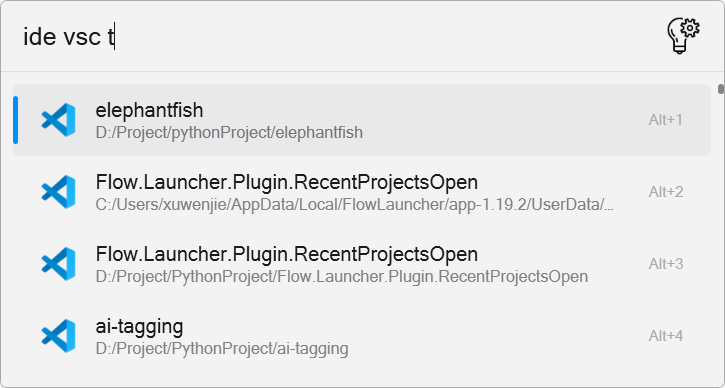
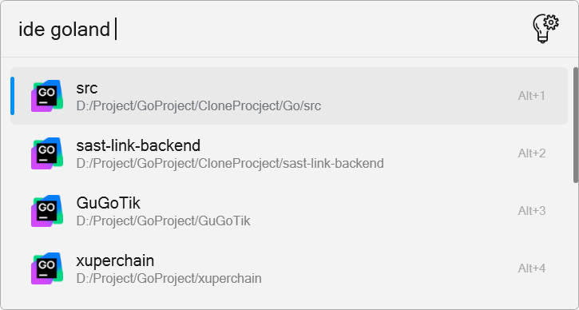

# Flow.Launcher.Plugin.RecentProjectsOpen

A plugin that allows users to quickly open recent projects with ease.

## Features

- **Quick Access**: Instantly open your recent projects from the plugin interface.

## Installation

## Usage

You can access different JetBrains IDEs using the following format:

- `vsc`: Visual Studio Code
- `as`: Android Studio
- `idea`: IntelliJ IDEA
- `goland`: GoLand
- `clion`: CLion
- `pycharm`: PyCharm

To open a project named "MyProject" in Visual Studio Code, you would use:

ide vsc MyProject

## License

This project is licensed under the MIT License. See the [LICENSE](LICENSE) file for details.
