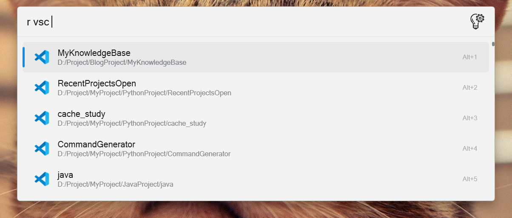
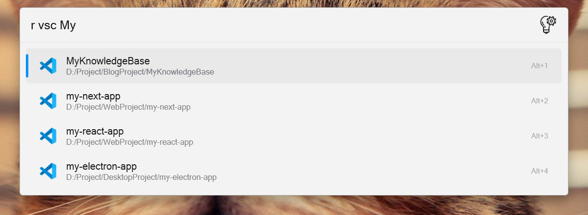
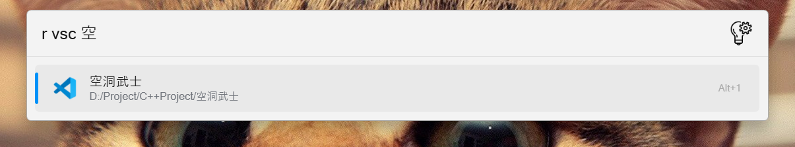

# Flow.Launcher.Plugin.RecentProjectsOpen

A plugin that allows users to quickly open recent projects with ease.

## Installation

Download from the store

## Configuration

To configure the `RecentProjectsOpen` plugin, you should edit the plugin's configuration file.

1. **Locate the Configuration File**:

   - The plugin's configuration file is located at:

     ```plaintext
     C:\Users\YourUsername\AppData\Local\FlowLauncher\app-1.19.3\UserData\Plugins\RecentProjectsOpen-1.0.0\src\.env
     ```
   - Replace `YourUsername` with your actual Windows username.
2. **Edit the File**:

   - Open the `.env` file with a text editor (e.g., Notepad, Visual Studio Code).
   - Add or modify the paths for your IDEs and their storage files as shown in the example above.

   ```plaintext
      VISUAL_STUDIO_CODE_DOWNLOAD=D:/VSCode/bin/code
      VISUAL_STUDIO_CODE_STORAGE=C:/Users/YourUsername/AppData/Roaming/Code/User/globalStorage/storage.json
      ANDROID_STUDIO_DOWNLOAD=D:/Android Studio/bin/studio64.exe
      ANDROID_STUDIO_STORAGE=C:/Users/YourUsername/AppData/Roaming/Google/AndroidStudio2024.1/options/recentProjects.xml
      INTELLIJ_IDEA_DOWNLOAD=D:/IntelliJ IDEA 2024.3/bin/idea64.exe
      INTELLIJ_IDEA_STORAGE=C:/Users/YourUsername/AppData/Roaming/JetBrains/IntelliJIdea2024.3/options/recentProjects.xml
      GOLAND_DOWNLOAD=D:/goland/GoLand 2023.2/bin/goland64.exe
      GOLAND_STORAGE=C:/Users/YourUsername/AppData/Roaming/JetBrains/GoLand2023.2/options/recentProjects.xml
      CLION_DOWNLOAD=D:/Clion/CLion 2024.1.4/bin/clion64.exe
      CLION_STORAGE=C:/Users/YourUsername/AppData/Roaming/JetBrains/CLion2024.1/options/recentProjects.xml
      CURSOR_DOWNLOAD=C:/Users/YourUsername/AppData/Local/Programs/cursor/Cursor.exe
      CURSOR_STORAGE=C:/Users/YourUsername/AppData/Roaming/Cursor/globalStorage/storage.json
   ```
3. **Save and Restart**:

   - Save the changes and restart Flow Launcher to apply the new configuration.

### Tips

- **Verify Paths**: Ensure that the paths you enter are correct and that the files or executables exist at those locations.
- **Permissions**: Make sure that Flow Launcher has the necessary permissions to access the specified directories and files.
- **Backup**: Before making changes to the `.env` file, create a backup copy in case you need to revert to the original settings.

## Usage and Supported applications

- [X] visual studio code
- [X] pycharm
- [X] clion
- [X] goland
- [X] intellij idea
- [X] android studio
- [X] cursor
- [X] sumatra pdf

You can access different IDEs using the following format:

```python
ABBREVIATE = {
    "vsc": "VISUAL_STUDIO_CODE",
    "py": "PYCHARM",
    "cl": "CLION",
    "go": "GOLAND",
    "in": "INTELLIJ_IDEA",
    "as": "ANDROID_STUDIO",
    "cur":"CURSOR"
}
```

To open a project named "MyProject" in Visual Studio Code, you would use:

r vsc



r vsc My



r vsc 空



## Feature

- [X] fuzzy search
- [X] support pinyin
- [X] prevent configurations from disappearing after updates

## Contribute

1. Create a new file in `src/application` directory (e.g., `myapp.py`)
2. Implement your application class by extending `BaseApplication` or `BaseJetBrains`
3. Register your application using the `@ApplicationRegistry.register` decorator
